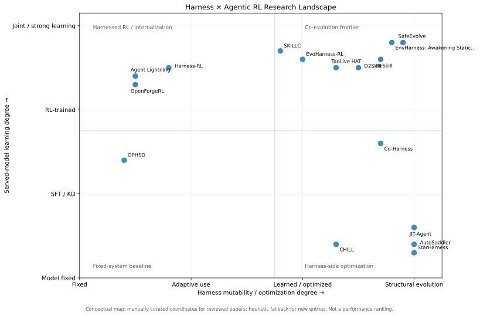
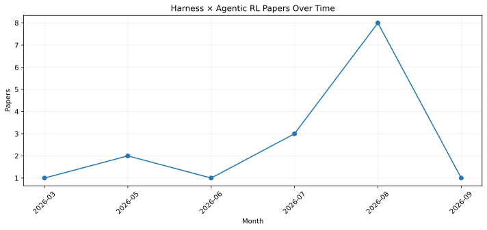
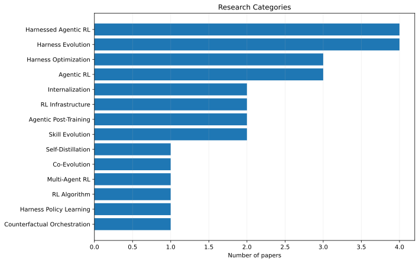
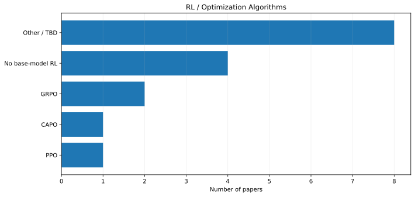
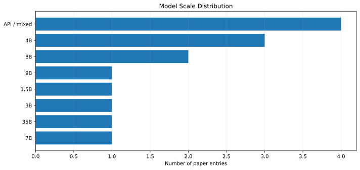
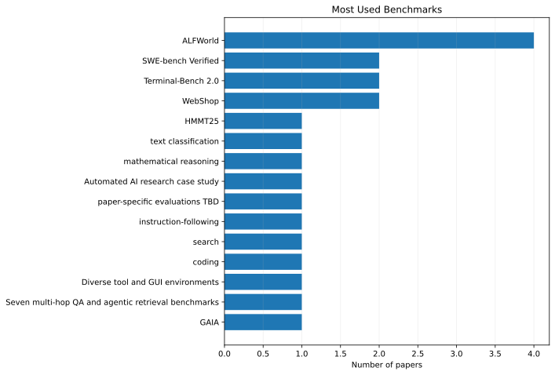
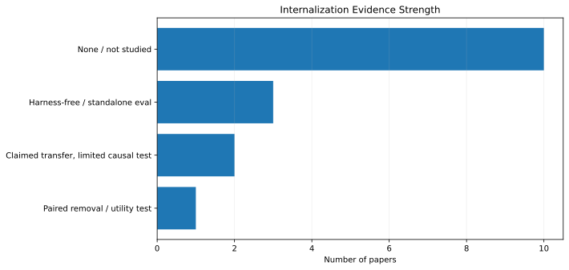

# Harnessed-Agentic-RL

A living literature map for **Harness × Agentic RL** research.

This repository tracks:

- Harness design and agent scaffolding
- Harness optimization / automatic harness evolution
- Harness–model / harness–policy co-evolution
- Agentic post-training and RL algorithms
- Skill / harness self-distillation and internalization
- Harness capability retirement / handoff
- Process-level reward and multi-turn credit assignment
- Diversity-preserving RL / exploration for open-ended agents
- Benchmarks, model scale, reward design, rollout protocol, and compute

## Repository layout

- `papers/papers.csv` — master structured literature table (being normalized as new papers are verified)
- `papers/recent-and-adjacent.md` — **high-priority recent papers and papers that directly threaten/shape novelty**
- `papers/harnessed-agentic-rl.md` — harness-native / harnessed RL
- `papers/harness-optimization.md` — harness optimization and evolution
- `papers/internalization.md` — self-distillation, capability handoff, retirement
- `papers/credit-assignment-and-diversity.md` — process reward, credit assignment, verifier coverage, and diversity-preserving methods relevant to idea graphs / scientific ideation
- `papers/benchmarks.md` — benchmark and environment index
- `papers/code-status.md` — official implementations and release status
- `notes/research-gaps.md` — open research questions and ICML-oriented gaps
- `scripts/generate_stats.py` — generates repository statistics from `papers/papers.csv`
- `.github/workflows/update-stats.yml` — automatically refreshes figures after literature-table updates

## Current must-track set

The core map includes OPHSD, Co-Harness, Agent Lightning v1.0, OpenForgeRL, Harness-RL, EvoHarness-RL, CHILL-Harness, SafeEvolve, JIT-Agent, AutoSaddler, StarHarness, EnvHarness, TaoLive HAT, ReSkill, D2Skill and SKILLC. The adjacent algorithmic tracker additionally follows recent work such as **PGPO** and **Coverage, Not Targeting**, plus high-value process-attribution/diversity work such as **CHIME**.

## Live statistics

These figures are generated automatically from `papers/papers.csv` by GitHub Actions whenever the paper table or statistics code changes.

### Research landscape

The x-axis is **Harness mutability / optimization degree**; the y-axis is **served-model learning degree**. Coordinates for papers we have already reviewed are manually curated; newly added papers get a heuristic fallback until reviewed. This is a conceptual research map, **not a performance ranking**.

### Papers over time

### Research categories

### RL / optimization algorithms

### Model scale

### Benchmarks

### Internalization evidence

## Tracked fields

For each paper we record, when available: title, authors, date, venue/arXiv, code, category, harness components, whether the harness is fixed/learned/evolved, update mechanism, RL algorithm, training target, model/parameter scale, training method, benchmark, environment type, reward, rollout usage, whether the harness changes during training, internalization test, component retirement, compute/training scale, headline results, relation to prior work, and open gaps.

## Source-code policy

We link to official implementations and record release status, license, key entrypoints/configs, harness directories, rollout/trajectory code, and RL/reward implementation locations when available. Third-party source code is not mirrored here unless licensing and a specific mirroring decision are made explicitly.
